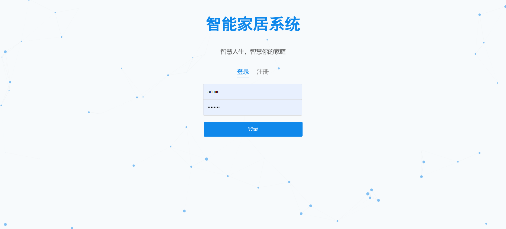
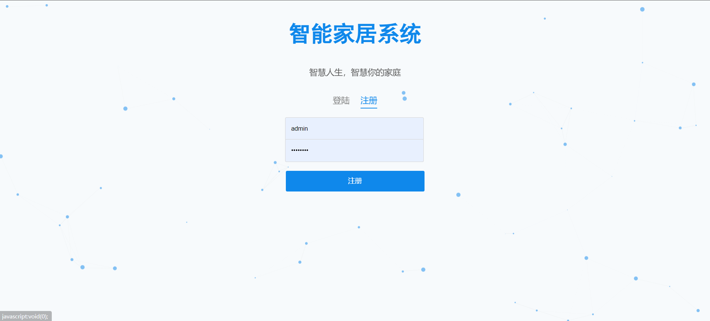
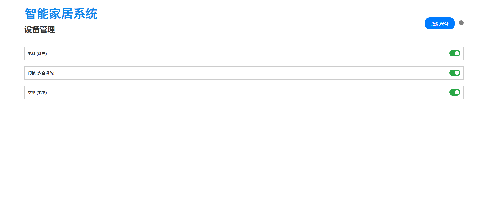
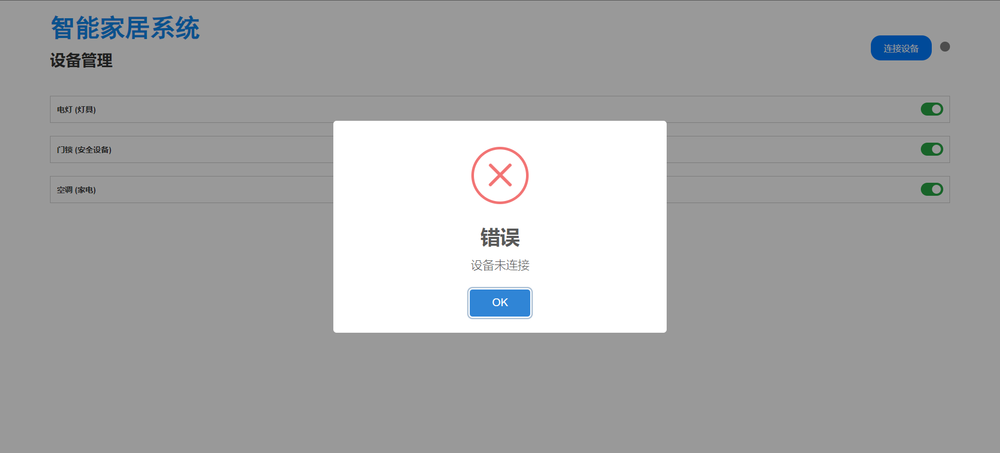
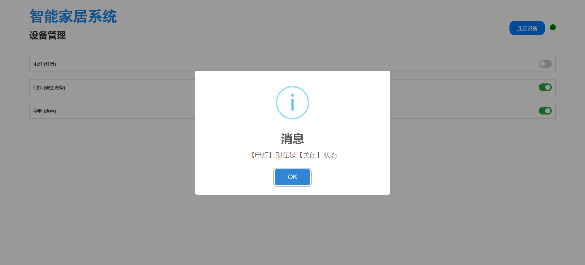
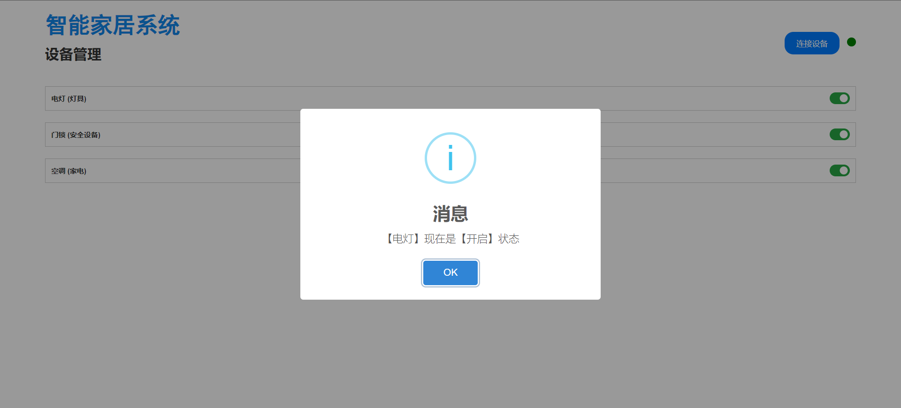

# 智能家居系统

这是一个基于 FastAPI 的智能家居管理系统，用户可以注册和登录系统，管理各种智能家居设备。

## 项目截图

### 登录界面



### 注册界面



### 设备管理界面



### 设备未连接提示



### 关闭设备



### 开启设备



## 运行教程

### 环境要求

- Python 3.11.9

### 安装依赖

首先，克隆项目仓库到本地，然后进入项目目录。

```bash
git clone https://github.com/loks666/smart_home.git
cd smart_home
```

安装项目依赖。

```bash
pip install -r requirements.txt
```

### 运行项目

使用 FastAPI 启动项目，默认端口是 8062。

```bash
uvicorn main:app --host 127.0.0.1 --port 8062 --reload
```

### 访问项目

在浏览器中打开以下地址，访问项目：

```
http://127.0.0.1:8062
```